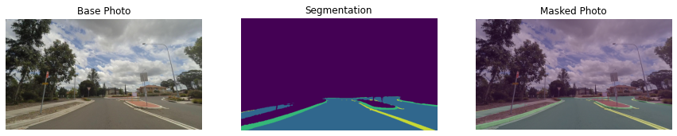

# OpenVINO Road Segmentation ADAS Example on WasmEdge Runtime

## Overview

In this example, we'll use `WasmEdge wasi-nn interfaces` to demonstrates a popular task used in the CV-based `Advanced Driver Assist Systems (ADAS)`: road segmentation.

|                                                                                                                             |                                                                                                                             |
| --------------------------------------------------------------------------------------------------------------------------- | --------------------------------------------------------------------------------------------------------------------------- |
|  |  |

The model files and the images used for this demonstration are from the [Intel openvino_notebooks repo](https://github.com/openvinotoolkit/openvino_notebooks/blob/main/notebooks/003-hello-segmentation/README.md) on Github.

## Set up the environment

- Install `rustup` and `Rust`

  Go to the [official Rust webpage](https://www.rust-lang.org/tools/install) and follow the instructions to install `rustup` and `Rust`.

  > It is recommended to use Rust 1.68 or above in the stable channel.

  Then, add `wasm32-wasi` target to the Rustup toolchain:

  ```bash
  rustup target add wasm32-wasi
  ```

- Clone the example repo

  ```bash
  git clone https://github.com/second-state/WasmEdge-WASINN-examples.git
  ```

- Install OpenVINO

  ```bash
  bash WasmEdge-WASINN-examples/scripts/install_openvino.sh
  ldconfig
  ```

- Install WasmEdge with Wasi-NN OpenVINO plugin

  ```bash
  export CMAKE_BUILD_TYPE=Release
  export VERSION=0.13.1

  curl -sSf https://raw.githubusercontent.com/WasmEdge/WasmEdge/master/utils/install.sh | bash -s -- -v $VERSION -p /usr/local --plugins wasi_nn-openvino
  ldconfig
  ```

## Build and run `openvino-road-segmentation-adas` example

- Download `MobileNet` model file

  ```bash
  cd openvino-road-segmentation-adas
  ```

- Build and run the example

  ```bash
  cd openvino-road-seg-adas
  cargo build --target wasm32-wasi --release
  cd ..

  wasmedge --dir .:. ./openvino-road-seg-adas/target/wasm32-wasi/release/openvino-road-seg-adas.wasm \
  ./model/road-segmentation-adas-0001.xml \
  ./model/road-segmentation-adas-0001.bin \
  ./image/empty_road_mapillary.jpg
  ```

  If the commands run successfully, an output tensor will be generated and saved to `wasinn-openvino-inference-output-1x4x512x896xf32.tensor`.

## Visualize the inference result

To visualize the input image and the inference output tensor, you can use the `visualize_inference_result.ipynb` file. You may have to modify some file paths in the file, if the files used in the notebook are dumped in different directories. The following picture shows the inference result of road segmentation task.


