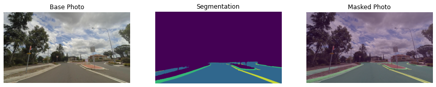

# OpenVINO Road Segmentation ADAS Example on WasmEdge Runtime

## Overview

In this example, we'll use `WasmEdge wasi-nn interfaces` to demonstrates a popular task used in the CV-based `Advanced Driver Assist Systems (ADAS)`: road segmentation.

|                                                                                                                             |                                                                                                                             |
| --------------------------------------------------------------------------------------------------------------------------- | --------------------------------------------------------------------------------------------------------------------------- |
|  |  |

The model files and the images used for this demonstration are from the [Intel openvino_notebooks repo](https://github.com/openvinotoolkit/openvino_notebooks/blob/main/notebooks/003-hello-segmentation/README.md) on Github.

## Contents

The comments in the project structure below describe the usage of each component.

```bash
.
├── README.md
├── image
│   └── empty_road_mapillary.jpg ---------------- (the input image)
├── image-preprocessor   ------------------------ (preprocess the input image)
│   ├── Cargo.lock
│   ├── Cargo.toml
│   └── src
│       └── main.rs
├── model --------------------------------------- (OpenVINO model files)
│   ├── road-segmentation-adas-0001.bin
│   └── road-segmentation-adas-0001.xml
├── openvino-road-segmentation-adas-0001 -------- (Create wasm module which invoke wasi-nn interface)
│   ├── Cargo.lock
│   ├── Cargo.toml
│   └── src
│       └── main.rs
├── tensor -------------------------------------- (Input/output tensors to/from wasm module)
│   ├── wasinn-openvino-inference-input-512x896x3xf32-bgr.tensor
│   └── wasinn-openvino-inference-output-1x4x512x896xf32.tensor
└── visualize_inference_result.ipynb ------------ (Visualize the original image and the inference output)
```

## Steps

### Prerequisites

To run this example on your local system, you need to guarantee the following depencies are installed:

- [Install OpenVINO 2021.4](https://docs.openvino.ai/2021.4/get_started.html)

- [Install WasmEdge Runtime](https://wasmedge.org/book/en/start/install.html)

- [Install OpenCV](https://github.com/twistedfall/opencv-rust#getting-opencv)

- Install Jupyter notebook (Optional)

*Notice that M1 Mac is not supported as OpenVINO cannot be installed on M1 Mac.*

### Preprocess Image

The `image-preprocessor` project uses the APIs of `opencv-rs` to preprocess the input image, such as resizing, and then converts the processed image into OpenVINO tensor.

```bash
cd image-preprocessor
cargo run -- --image ../image/empty_road_mapillary.jpg --dims 512x896x3xf32 --output wasinn-openvino-inference-input-512x896x3xf32-bgr.tensor
```

or

```bash
cd image-preprocessor
cargo build --release
./target/release/im2tensor --image ../image/empty_road_mapillary.jpg --dims 512x896x3xf32 --output wasinn-openvino-inference-input-512x896x3xf32-bgr.tensor
```

### Generate model inference wasm module

This project contains the main steps of model inference task, including creating `OpenVINO graph` from the given model files, performing inference, and then dumping the output tensor to a file. This project will be compiled into a wasm module, which will be run on `WasmEdge runtime`. Before building the project, use `rustup target list` command to check if the `wasm32-wasi` target has already been installed. If it has not, use `rustup target add wasm32-wasi` to install the target. Then, you can use the following commands to build the project.

```bash
cd openvino-road-segmentation-adas-0001
cargo build --target=wasm32-wasi --release
```

If the build is successful, you can find `rust-road-segmentation-adas.wasm` file. That will be used as one of the input parameter of the `wasmedge` command.

### Do inference on WasmEdge runtime

Please check if WasmEdge runtime has already installed on your system or not. If it has not, please reference the [Install and Uninstall WasmEdge](https://wasmedge.org/book/en/start/install.html) guide to deploy WasmEdge runtime. Run the command `wasmedge --version` in terminal and if you can see `wasmedge version 0.10.0-71-ge920d6e6` or similar version information, it means WasmEdge runtime has been installed successfully.

Now, run the following command in the root directory of this repo to perform the inference on the WasmEdge runtime.

```bash
wasmedge --dir .:. rust-road-segmentation-adas.wasm ./model/road-segmentation-adas-0001.xml ./model/road-segmentation-adas-0001.bin wasinn-openvino-inference-input-512x896x3xf32-bgr.tensor
```

The generated output tensor will be dumped to the `wasinn-openvino-inference-output-1x4x512x896xf32.tensor` file if the command runs successfully.

### Visualize the inference result

To visualize the input image and the inference output tensor, you can use the `visualize_inference_result.ipynb` file. You may have to modify some file paths in the file, if the files used in the notebook are dumped in different directories. The following picture shows the inference result of road segmentation task.


